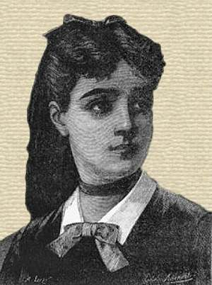
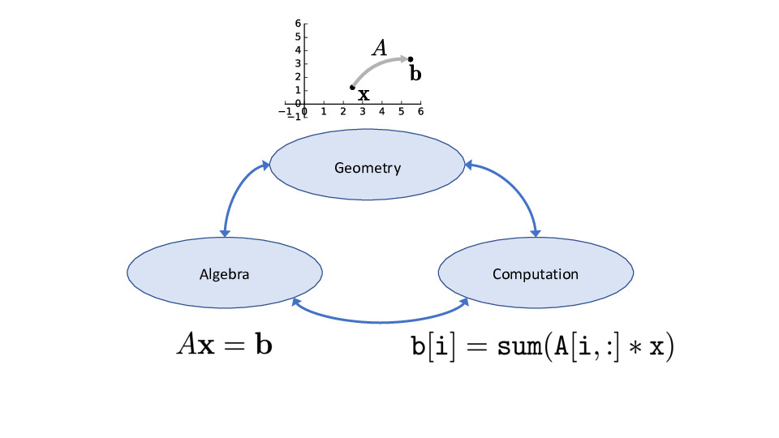

> Algebra is but written geometry.
>
> Sophie Germain

# Preface

Welcome to this book!

These are lecture notes for Computer Science 132, _Geometric
Algorithms,_ as taught by me at Boston University.  The overall
structure of the course is roughly based on _Linear Algebra and its
Applications,_ by David C. Lay, Addison-Wesley (Pearson).   However all
the content has been significantly revised by me.  The book also
includes contributions and improvements from Wayne Snyder, as well as
from students who have taken CS 132 (see the list of contributors [here](https://github.com/mcrovella/CS132-Geometric-Algorithms/)).

## Format

The notes are in the form of Jupyter notebooks.   Demos and most figures
are included as executable Python code.   All course materials are in
the github repository
[here.](https://github.com/mcrovella/CS132-Geometric-Algorithms)

Each of the Chapters is based on a single notebook, and each forms the
basis for one lecture (more or less).

Note that all of the 3D figures used in this book can be viewed in
augmented reality using the app **DiagramAR.**  Using DiagramAR you can look at the
figures "in space'' and can move around them to look at them from
different angles, rotate them, or zoom in/out.  DiagramAR is available
for [iOS](https://apps.apple.com/us/app/diagramar/id1484987191) and  [Android](https://play.google.com/store/apps/details?id=com.crovella.diagramar).
Adapting DiagramAR for any course that uses python for 3D figure creation
is not hard; contact me for details.

## Teaching Approach

> Five-dimensional shapes are hard to visualize -- but it doesn't mean
> you can't think about them.   Thinking is really the same as seeing.
> WIlliam Thurston

The rationale for the teaching approach used in this course is
[here.](https://github.com/mcrovella/CS132-Geometric-Algorithms/blob/master/Collateral/CS132-Teaching-Philosophy.pdf)
In brief:

Students learning Linear Algebra need to develop three modes of
thinking.   The first is _algebraic_ thinking -- how to correctly manipulate symbols
in a consistent logical framework, for example to solve equations.   The
second is _geometric_ thinking: 
learning to extend familiar two- and three-dimensional concepts to
higher dimensions in a 
rigorous way.    The third is _computational_ thinking: understanding the
relationship between abstract algebraic machinery and actual
computations which arrive at the (hopefully) correct answer to a specific problem in
an efficient way.

Each mode provides a 
  distinct, powerful way of thinking about a problem, and so
  using the full power of linear algebra requires being able to switch between
  these modes with fluidity.
 However, these three modes of thinking are quite different, and
often students are better at some modes than others.   For example, here
are three views of matrix-vector multiplication:

Jupyter notebooks (including the use of [RISE](https://rise.readthedocs.io/en/stable/) for presentation, python
for computation, and
[jupyter books](https://jupyterbook.org/intro.html) for reference) are an ideal teaching environment to take on
this challenge.   Hence the goal of these notes is to take advantage of
the Jupyter toolchain to interweave these
modes on a fine grain, frequently moving from one mode to the other, to
constantly reinforce connections between ways of thinking about linear algebra.

I hope you enjoy this book, whose goal is to __prevent__ you from falling
into this trap:

> Algebra is the offer made by the devil to the mathematician. The devil
> says: I will give you this powerful machine, it will answer any
> question you like. All you need to do is give me your soul: give up
> geometry and you will have this marvelous machine.
>
> Sir Michael Atiyah, 2002

And to conclude, here is an anonymous review from Fall 2022:

>I thought when the Professors were talking about how linear algebra is
>"beautiful", they were exaggerating, but by the end of the course, I
>understood why this is true. 
